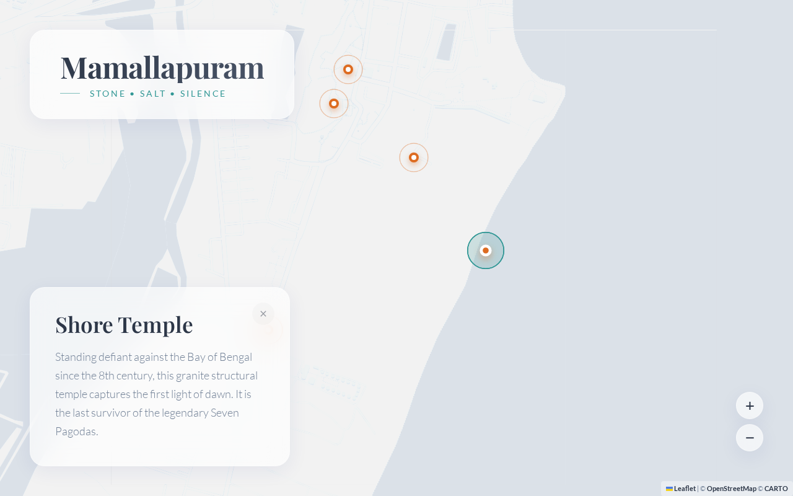

# Mamallapuram | Coastal Serenity

A visually immersive, story-driven digital map experience capturing the essence of Mamallapuram. This project demonstrates a "World Class" approach to UI/UX design, transforming a functional map into an emotional journey through stone, salt, and silence.



## Design Philosophy

The interface is built on the concept of **Coastal Serenity**. It prioritizes emotional resonance over information density, using a carefully curated palette and fluid interactions to mirror the coastal atmosphere of the ancient town.

*   **Palette:** Soft "Alice Blue" (`#F0F4F8`) backgrounds mimic the sea mist, while "Soft Peach" (`#F6AD55`) and "Teal" (`#38B2AC`) accents represent the sun-warmed granite and the Bay of Bengal.
*   **Glassmorphism:** UI elements use backdrop filters to blur the underlying map, creating a sense of depth and modernity (`.glass-card`).
*   **Typography:** *Playfair Display* lends a timeless, editorial elegance to headings, paired with *Lato* for clean, legible body text.
*   **Motion:** Interactions are choreographed with `flyTo` camera movements and smooth entry animations, ensuring every click feels purposeful and fluid.

## Technical Implementation

*   **Engine:** Leaflet.js (v1.9.4) via CDN.
*   **No Plugins:** All visual effects, including the pulsing markers and glassmorphism, are achieved with pure CSS and vanilla JavaScript.
*   **Map Tiles:** Custom CSS filters apply a "sepia-cool" tint to standard CartoDB Light tiles, integrating them seamlessly into the pastel theme.
*   **Accessibility:** Fully semantic HTML, including accessible buttons and focus states for keyboard navigation.
*   **Responsiveness:** Adaptive layouts ensure a seamless experience across mobile and desktop devices.

## Usage

This project is deployed as a static site. The core logic resides in `public/index.html`.

### Run Locally
Serve the `public` directory:
```bash
npx serve public
```
